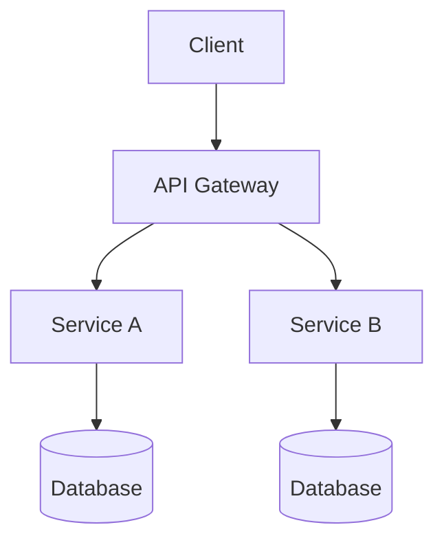
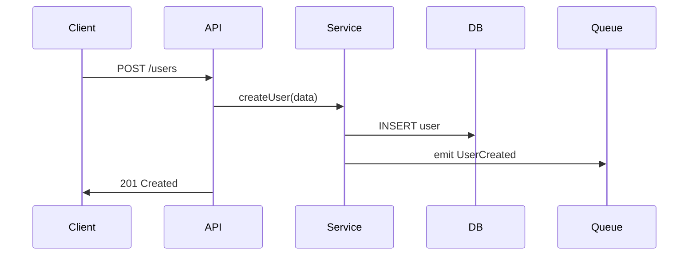

# Architecture Overview

> **Instructions**: Document your system's architecture here. This is loaded by agents to understand the current system design. Update this document whenever significant architectural changes are made. Create an ADR for each major decision.

## System Overview

<!-- High-level description of the system: what it does, how it is structured, and what technologies it uses. -->

[Describe your system at a high level]

## Architecture Style

<!-- Which pattern does your system follow? Reference governance/skills/architecture-patterns.md -->

- **Pattern**: [Layered / Hexagonal / Event-Driven / CQRS / Microservices / Hybrid]
- **Rationale**: [Why this pattern was chosen]
- **ADR Reference**: [Link to the ADR documenting this decision]

## Component Diagram

<!-- Use Mermaid syntax for portability. -->

## Technology Stack

| Layer | Technology | Version | Rationale |
|-------|-----------|---------|-----------|
| Language | [e.g., TypeScript] | [e.g., 5.x] | [Why] |
| Framework | [e.g., Next.js] | [e.g., 14.x] | [Why] |
| Database | [e.g., PostgreSQL] | [e.g., 16] | [Why] |
| Cache | [e.g., Redis] | [e.g., 7.x] | [Why] |
| Messaging | [e.g., RabbitMQ] | [e.g., 3.x] | [Why] |
| Hosting | [e.g., AWS ECS] | [N/A] | [Why] |

## Module Boundaries

<!-- Define the major modules/services and their responsibilities. -->

| Module | Responsibility | Owns | Depends On |
|--------|---------------|------|------------|
| [Module 1] | [What it does] | [Data/tables] | [Dependencies] |
| [Module 2] | [What it does] | [Data/tables] | [Dependencies] |

## Data Flow

<!-- Describe how data flows through the system for key operations. -->

### [Operation Name, e.g., "User Registration"]

## Cross-Cutting Concerns

| Concern | Approach | Implementation |
|---------|----------|----------------|
| Authentication | [e.g., JWT with RS256] | [Where implemented] |
| Authorization | [e.g., RBAC] | [Where implemented] |
| Logging | [e.g., Structured JSON] | [Library/framework] |
| Monitoring | [e.g., Prometheus + Grafana] | [Where configured] |
| Error Handling | [e.g., Global error middleware] | [Where implemented] |

## Architectural Constraints

<!-- List constraints that limit architectural choices. -->

- [Constraint 1, e.g., "Must run on AWS due to existing infrastructure"]
- [Constraint 2, e.g., "Must support 10K concurrent users"]
- [Constraint 3, e.g., "Must comply with GDPR for EU users"]
