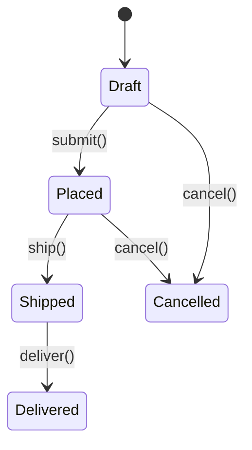
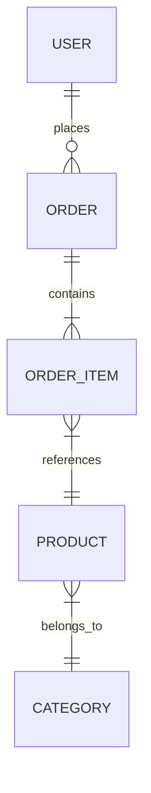

# Domain Model

> **Instructions**: Document the core domain entities, their relationships, and business rules. This helps agents understand your business domain and use consistent terminology. Update when the domain evolves.

## Domain Overview

<!-- Brief description of the business domain this system operates in. -->

[Describe your business domain]

## Core Entities

<!-- List the primary entities in your domain with their key attributes and invariants. -->

### [Entity Name, e.g., "Order"]

| Attribute | Type | Constraints | Description |
|-----------|------|-------------|-------------|
| [id] | [UUID] | [required, unique] | [Unique identifier] |
| [status] | [enum] | [required] | [Current state: draft, placed, shipped, delivered] |
| [total] | [Money] | [required, >= 0] | [Calculated total amount] |

**Business Rules:**
- [Rule 1, e.g., "An order must have at least one item"]
- [Rule 2, e.g., "Order total is recalculated when items change"]

**State Transitions:**

### [Entity Name 2]

<!-- Repeat the pattern above for each core entity. -->

## Entity Relationships

## Value Objects

<!-- Identify value objects (immutable, equality by value, no identity). -->

| Value Object | Attributes | Validation Rules |
|--------------|-----------|-----------------|
| [e.g., Money] | [amount, currency] | [amount >= 0, currency is ISO 4217] |
| [e.g., Address] | [street, city, zip, country] | [all required, zip matches country format] |

## Aggregates

<!-- Define aggregate roots and their boundaries. -->

| Aggregate Root | Contains | Invariants |
|---------------|----------|------------|
| [e.g., Order] | [OrderItem, ShippingAddress] | [Total must match sum of items] |

## Domain Events

<!-- Events that occur when something significant happens in the domain. -->

| Event | Triggered By | Contains | Consumers |
|-------|-------------|----------|-----------|
| [e.g., OrderPlaced] | [Order.submit()] | [orderId, userId, items, total] | [Inventory, Notification] |
